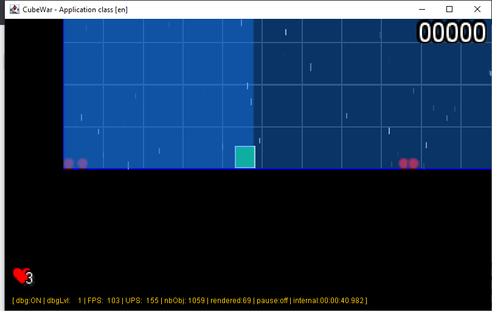

# README


## Context

This is the readme file for JavaTestApp (1.0.0) project.

The java project can be built or executed through the provided `scripts/build.sh` script, see reference later in this
README for more info on this build script.

## Build

To build the project, just execute the following command line :

```bash
$> build.sh a
```

## Run

To execute the build project, just run it with :

```bash
$> build.sh r
```

or you can execute the command line :

```bash
$> java -jar target/JavaTestApp-1.0.0.jar
```



## Debug

you may use the jdb command line :

```bash
jdb -sourcepath src/main/java/,src/main/resources \
    target/classes/com/snapgames/demo/Application
```

## Reference

### Build script

> **NOTE** _To get more information this script usage, just execute the following command line:_
>
> ```bash
> $> scripts/build.sh
> Build of program 'JavaTestApp-1.0.0' ...
> -----------
> build2 command line usage :
> ---------------------------
> $> build2 [options]
> where:
> - a|A|all     : perform all following operations
> - c|C|compile : compile all sources project
> - d|D|doc     : generate javadoc for project
> - t|T|test    : execute JUnit tests
> - j|J|jar     : build JAR with all resources
> - w|W|wrap    : Build and wrap jar as a shell script
> - s|S|sign    : Build and wrap signed jar as a shell  script
> - r|R|run     : execute (and build if needed) the  created JAR
>
> (c)2022 MIT License Frederic Delorme (@McGivrer) fredericDOTdelormeATgmailDOTcom
> --
> -----------
> ... done.
> ```

### Keys from the demo

| Key                                                               | description                                              |
| :---------------------------------------------------------------- | :------------------------------------------------------- |
| <kbd>UP</kbd>, <kbd>DOWN</kbd>, <kbd>LEFT</kbd>, <kbd>RIGHT</kbd> | Move player vertically <br/>or horizontally              |
| <kbd>ALT</kbd>+<kbd>UP</kbd>, <kbd>ALT</kbd>+<kbd>DOWN</kbd>      | Player rotation left or right                            |
| <kbd>CTRL</kbd>+<kbd>D</kbd>, <kbd>D</kbd>                        | Activate debug display, <br/>change debug level (0 to 5) |
| <kbd>PAGE-UP</kbd>, <kbd>PAGE-DOWN</kbd>                          | Camera roll                                              |
| <kbd>ALT</kbd>+<kbd>BACKSPACE</kbd>                               | Reset camera roll to initial position                    |
| <kbd>CTRL</kbd>+<kbd>Z</kbd>                                      | Reset Scene                                              |
| <kbd>ESCAPE</kbd>,<kbd>Q</kbd>                                    | Exit demonstration                                       |
| <kbd>P</kbd>,<kbd>PAUSE</kbd>                                     | set/unset Game update in pause mode                      |
| <kbd>G</kbd>                                                      | Reverse World gravity                                    |
| <kbd>F3</kbd>                                                     | take screen shot (not implemented yet)                   |

Enjoy !

Frédéric.
