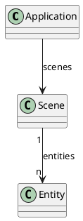

## The Application

Lorem ipsum dolor sit amet, consectetur adipiscing elit, sed do eiusmod tempor incididunt ut labore et dolore magna aliqua. Ut enim ad minim veniam, quis nostrud exercitation ullamco laboris nisi ut aliquip ex ea commodo consequat. Duis aute irure dolor in reprehenderit in voluptate velit esse cillum dolore eu fugiat nulla pariatur. Excepteur sint occaecat cupidatat non proident, sunt in culpa qui officia deserunt mollit anim id est laborum. Vivendum intellegat et qui, ei denique consequuntur vix. No vis iuvaret appareat. No epicuri hendrerit consetetur sit, sit dicta adipiscing ex, in facete detracto deterruisset duo. Pri posse graeco definitiones cu, id eam populo quaestio adipiscing, usu quod malorum te. An dicant apeirian qui, at vide indoctum pro. Scripta periculis ei eam, te pro movet reformidans. Commune platonem mel id, brute adipiscing duo an. Sit fugit nostrum et. Vivendum intellegat et qui, ei denique consequuntur vix. Ex nam agam veri, dicunt efficiantur ad qui, ad legere adversarium sit. Offendit eleifend moderatius ex vix, quem odio mazim et qui, purto expetendis cotidieque quo cu, veri persius vituperata ei nec. Pri posse graeco definitiones cu, id eam populo quaestio adipiscing, usu quod malorum te. Pri viderer tamquam ei. Scripta periculis ei eam, te pro movet reformidans.

