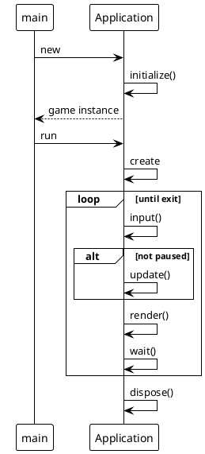

## The Application

### Goals

The main class for the full application will consist in the core loop of our game.
The `Application` class will embed all the required loop structure and API initial call.



_figure 1.1 - The initial lifecycle API call from the `Application` main class, inherited by any game implementation._

### The Application class

The game loop lifecycle will mostly inspire our Application class :

```java
public class Application {
    private void initialize() {
    }

    private void create() {
    }

    private void loop() {
    }

    private void input() {
    }

    private void update() {
    }

    private void render() {
    }

    private void wait() {
    }

    private void dispose() {
    }

    public void run(String[] args) {
    }
}
```

These are all the main methods to be implemented. We will also need some attributes, to get a sustainable main loop:

the main entry point if the `Application.run()` method.

To use the Application class:

```java
public class MyApp {
    public static void main(String argc[]) {
        Application app = new Application();
        app.run(argc);
    }
}
```

```java
public class Application {
    private boolean exit;
    private boolean pause;

    public void initialize() {
    }
    //...
}
```

- the `exit` attribute is a flag to tell the main loop if the loop is ending or not,
- the `pause` attribute intends to tell the update phase to stay in pause mode or not.

Some new attribute will be added along the code exploration and development.

#### The main loop implementation

The core function of our `Application` class i s the loop method.
Everything is sync from this loop.

```java
public class Application {
    private boolean exit;
    private boolean pause;

    //...
    private void loop() {
        FPS = 60;
        UPS = 60;

        long start = System.nanoTime();
        long previous = start;
        long elapsedTime = 0;
        int fpsTime = 0;
        int realFPS = 0;
        int realUPS = 0;
        int frames = 0;
        int updates = 0;
        int wait = 0;
        long cumulatedGameTime = 0;
        long upsTime = 0;
        Map<String, Object> datastats = new HashMap<>();
        do {
            scene = ((SceneManager) GSystemManager.find(SceneManager.class)).getCurrent();
            start = System.nanoTime();
            long elapsed = start - previous;

            input(inputHandler, scene);
            if (!pause) {
                if (upsTime > (1000.0 / UPS)) {
                    physicEngine.update(scene, elapsed * 0.00000002, datastats);
                    spacePartition.update(scene, elapsed * 0.00000002);
                    cd.update(scene, elapsed * 0.00000002, datastats);
                    cd.reset();
                    updates++;
                    upsTime = 0;
                }

                upsTime += (elapsed * 0.00001);
                cumulatedGameTime += elapsed * 0.000001;
            }
            if (fpsTime > (1000.0 / FPS)) {
                renderer.draw(physicEngine.getWorld(), scene, datastats);
                frames++;
                fpsTime = 0;
            }

            fpsTime += (elapsed * 0.00001);
            previous = start;
            elapsedTime += (elapsed * 0.000001);
            if (elapsedTime > 1000) {
                realFPS = frames;
                realUPS = updates;
                traceStatsCycle(scene, realFPS, realUPS, datastats);

                elapsedTime = 0;
                frames = 0;
                updates = 0;
            }
            waitNextCycle(elapsed);
        } while (!exit);
    }
    //...
}
```


