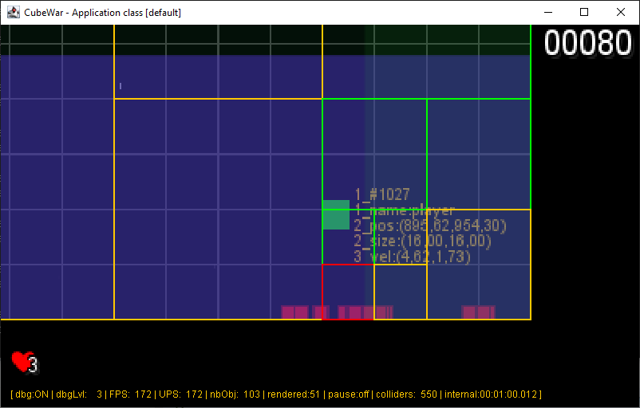

## Entity

Everything in the `Application` implementation, displayed or not, will be managed as an `Entity`.

`Entity` is at the core for anything in the `Application`, a visual object like a player's game object, or a virtual
object (not
displayed).

The `Entity` will support all kinds of operation and processing, moving, life duration processing, particle behavior,
etc...

This `Entity` can have multiple child and a parent, it must be uniquely identified, and having a human friendly name,
support speed, and acceleration.

### Entity's extensive list of attributes

The Entity must be supporting some attributes, so it would support:

1. **Node management**
    - _index_: the internal entity counter to initialize id for new `Entity`,
    - _id_: the unique identifier for this `Entity` instance,
    - _name_: the defined name for this `Entity`,
    - _parent_: the parent Entity for this one if it exists,
    - _child_: a list of child's `Entity`.

2. **Lifecycle**
    - _active_: flag to define if the entity is active anymore or must be removed (active=false),
    - _enabled_: temporarily disabling this `Entity`,
    - _duration_: if set to another value from -1, it will remain active until the time is 0 (starting from this
      duration
      value),
    - _lifetime_: the entity's remaining lifetime before deactivated.

3. **Drawing process**
    - _position_: the current position in the play area,
    - _size_: the current size (bounding box),
    - _color_: the drawing main color for this `Entity` (mainly for a border drawing),
    - _fillColor_: the color used to fill any `Entity`'s surface area.
    - _layer_: a layer number to distribute `Entity` on multiple layers
    - _priority_: a priority number to order `Entity` in each layer.

4. **Physic computation**
    - _velocity_: the current resulting velocity for this `Entity`,
    - _acceleration_: the current resulting Acceleration for this `Entity`,
    - _rotation_: the current resulting rotation angle for this `Entity`,
    - _dRotation_: the current resulting rotation speed for this `Entity`.
    - _mass_: the mass for this `Entity`
    - _material_: the Material instance applied to this `Entity`,
    - _constrainedToPlayArea_: a flag to define is this `Entity` is constrained in its move into the defined `World`'s
      play area,
    - _entityIsConstrained_: a flag to define is this `Entity` is constrained by the World's defined `Perturbation`.
    - _behaviors_: a list af `Behavior` implementations to be applied to the `Entity` at updated time.

5. **Extensible attribute**
    - _attributes_: a map of free objects to define new dynamic attributes for game development purpose.

### the Implementation

```java
public class Entity<T extends Entity<?>> extends Rectangle2D.Double {


    public static int index = 0;
    protected int id = ++index;
    public String name;

    public double rotation;
    public Vector2D oldPos = Vector2D.ZERO();
    public Vector2D pos = Vector2D.ZERO();
    public Vector2D vel = Vector2D.ZERO();
    public Vector2D acceleration = Vector2D.ZERO();
    public PhysicType physicType = PhysicType.DYNAMIC;

    public List<Vector2D> forces = new ArrayList<>();
    public double dRotation;
    public Material material;
    public double mass;
    private boolean entityIsConstrained;
    public boolean constrainedToPlayArea;
    public boolean stickToCamera;
    public int contact;

    public boolean active;
    public boolean enabled;
    protected int duration = -1;
    protected int lifespan;

    private Class<? extends RendererPlugin<?>> drawnBy;
    protected Color color = Color.WHITE;
    protected Color fillColor = Color.RED;
    protected int layer;
    protected int priority = 1;

    Map<String, Object> attributes = new HashMap<>();

    public List<Behavior<?>> behaviors = new ArrayList<>();

    public int debug = 5;

    public Entity<?> parent;
    public List<Entity<?>> child = new CopyOnWriteArrayList<>();
    /*
     * more to come...
     */
}
```

The main `Entity` constructor will initialize name, position and size, and a lot of things to its default value:

```java
public class Entity<T extends Entity<?>> extends Rectangle2D.Double {

    //...
    public Entity(String n, double x, double y, double w, double h) {
        setName(n);
        setPosition(x, y);
        setSize((int) w, (int) h);
        setEnabled(true);
        setActive(true);
        setStickToCameraView(false);
        setConstrainedToPlayArea(true);
        setMaterial(Material.DEFAULT);
        setMass(1.0);
        setEntityIsConstrained(true);
    }
    //...
}
```

The main specific processing for this `Entity` class is the update() method: computing the pasting time and
possible duration and its remaining lifetime.

```java
public class Entity<T extends Entity<?>> extends Rectangle2D.Double {
    //...
    public void update(double elapsed) {

        lifespan += elapsed;
        if (duration != -1 && lifespan > duration) {
            this.enabled = false;
        }
    }
    //...
}
```

And the last but not least is the debug info provisioning, only used by the debug display mode to show on
screen `Entity` attributes value when debug level is at least equal to `Entity` debug level:

```java
public class Entity<T extends Entity<?>> extends Rectangle2D.Double {
    //...
    public List<String> getDebugInfo() {
        List<String> info = new ArrayList<>();
        info.add(String.format("1_#%d", id));
        info.add(String.format("1_name:%s", name));
        info.add(String.format("2_pos:(%.02f,%.02f)", pos.x, pos.y));
        info.add(String.format("2_size:(%.02f,%.02f)", width, height));
        info.add(String.format("3_vel:(%.02f,%.02f)", vel.x, vel.y));
        info.add(String.format("4_acc:(%.02f,%.02f)", acceleration.x, acceleration.y));
        if (mass != 0.0)
            info.add(String.format("4_mass:%.02f kg", mass));
        if (material != null)
            info.add(String.format("4_mat:%s", material));
        return info;
    }
    //...
}
```

here is a screenshot of the debug mode with a debug level set to 3:



_figure 3.1 - Displaying some debug info on screen_

An `Entity` instance is not directly added to the `Application` implementation class, but to a `Scene` instance (see
next chapter [Scene](chapter-04-scene.md)).
